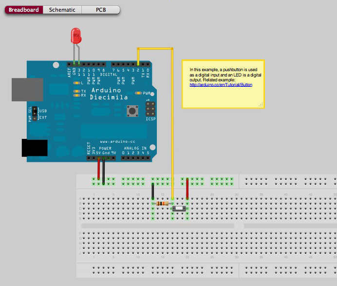

# Secret Server
From the outside, this appears to be a regular web server. But as long as the digital button is pressed, a second, secret page is shown to the visitors.

## Installation
1. Clone/download this repository
2. Attach a digital button to pin 2 (see image below for a possible setup)
3. Upload the files to the intel edison
4. Start the script
5. Navigate to the your edison on port `3000`, eg. `http://192.169.0.101:3000`

#### Digital Button Setup (ignore the LED)

Image Copyright: [omer](http://fritzing.org/profiles/omer/) on fritzing.org (CC BY-SA)
